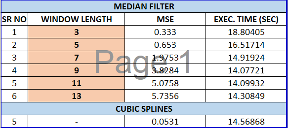
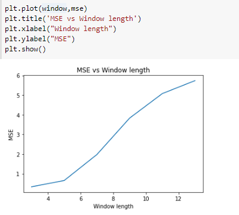
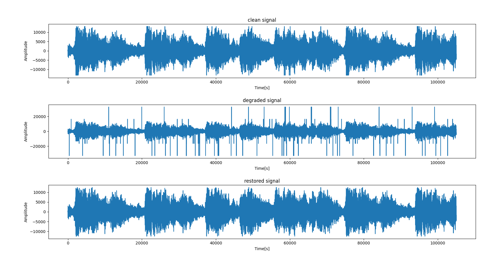

# Audio Restoration through Median Filter and Cubic Spline Interpolation Methods 
Audio restoration is performed through two different interpolation methods (Median Filter and Cubic Splines). The Mean squared error and execution time is computed for the restored and clean signal for different window sizes in median filter and cubic splines and are compared to each other. A graph is plotted to show the results. 

## High-level Description of the project
This Assignement follows up on the previous assignment - I, where in audio restoration was successfully performed using Auto-regression method in MATLAB. 

I) MEDIAN FILTER INTERPOLATION

The Medain Filter Interpolation assignment is started by importing the detection file (A .mat file which contains an array of 0's and 1's, with 1's denoting all the click locations) from MATLAB and reading it for application of median filter interpolation method. The other input parameter is the window length (A window of digital data upon which the median functionality will be performed). The window length size cannot be even, always has to be odd and an error will be displayed if an even window size is selected.

The output of the function return the restored audio data without the clicks. Inside the main function, we also call the designed median filter function to remove the clicks. The median filter function works in the following order
1) It selects a window of data around the click
Example :
suppose window = 3, click data = 2000
Data = [1,2000,3,4,5,6,7,8,9]
Window = [1,2000,3]
2) It adds a zero pad wrapping over the window so that all values are considered for the median selection.
Example:
[0,1,2000,3,0]
First Window = [0,1,2000]
Second Window = [1,2000,3]
Third Window = [2000,3,0]
3) It sorts the data inside the window.
Example:
Sorted windows = [0,1,2000], [1,3,2000], [0,3,2000]
4) It replaces the click with the median value of the window.
Example:
Final window = [1,3,3]
5) It replaces the window in the data signal with the new window, which removes the clicks
Example:
Restored Data = [1,3,3,4,5,6,7,8,9]

This function is iterated over all the clicks and the clean restored signal is obtained. A graph containing the clean, degraded and restored signal is plotted for comparision. 

Finally the mean squared error and execution time is compared for different window length.

Moreover, two unit tests are performed to check the resotored data values correctness, comaparing with the inbuilt median filter function from Python library Scipy.

II) CUBIC SPLINES INTERPOLATION

The cubic spline interpolation is performed using the inbuilt cubic spline interpolate inbuilt function available in Python Library Scipy.interpolate

The location of the clicks of the degarded audio is already available through the detection file from MATLAB. The restored signal is obtained in the following steps

1) A new array, containing the signal data without the clicks is created, which is named as the Y_ind array.
Example
Signal = [101,10,2000,30,40,50,60,72], click = 2000
Y_ind = [101,10,30,40,50,60,72]
2) Another array, containing the indices of the signal data without the clicks are created, which is named as the X_ind array.
X_ind = [0,1,3,4,5,6,7]
3) A cubic spline function is created through X_ind and Y_ind.
f(x,y) = spline(X_ind, Y_ind)
4) The cubic spline function is applied in the location of clicks and the clicks are overwritten with the new values from the function.

A graph is plotted for the restored signal and compared with the clean signal. The mean square error is computed further to confirm the claim.

## Installation and Execution

1)The pipreqs txt file available in the Github provides all the versions and libraries of the import files used in the project.

2)After installing all the import packages, the main file and cubic spline file can be run using the command in the CMD terminal
python main.py
python cubspl_filter.py

3) The wavwrite file and play audio file is commented as the restored files are already inside the Github. Both the commands can be uncommented for its respective functions to run. 

4) For different window length outputs, the window length has to be changed manually and outputs needs to be observed.

## Methodology and Results

Two Unittests are checked in the meduan filter program to confirm its functionality.
1) Check Length : The length of the signal data array of the clean, degraded and restored array's are checked. The test is passed, if all the lengths are same.
2) Inbuilt Function = designed Function : The designed function returned values are compared with the values obtained from the Inbuilt Function from Scipy. If both values are same, the test is passed.

Finally, the MSE for the Cubic Spline and Median Filter provides the accuracy of the filters. However for median filter it is obeserved that changing window lengths leads to different MSE.

**Results**

1. For the median filter, different lengths were explored to test the effectiveness of the restoration. 
A Table is made to note the different MSE's for different window length.

Moreover a graph is plotted to visualise the MSE vs Window length

In particular, the clean, degraded and restored signals were plotted and compared.

2. The output waveform using the cubic splines is also shown below, 

3. Comparing the two different interpolation methods, we notice that cubic slpines achieves a lower MSE than Median filter. The runtime of Cubic slpines is also less compared to Median Filter with window = 3, which has the minimum mse. 

After listening to the two restored files, we notice that all the clicks have been removed. 
Hence we conclude that both the methods work for audio restoration, with Cubic spline edging a better accuracy and runtime. 

---
## Credits

This code was developed for purely academic purposes by (ADG4050) as part of the module of Computational Methods (5c22) in Trinity College Dublin

The following resources were analysed for the same:
- Lecture Modules by Dr Angeliki Katsenou

