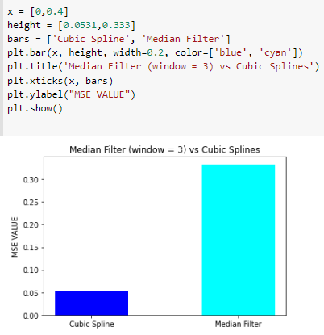
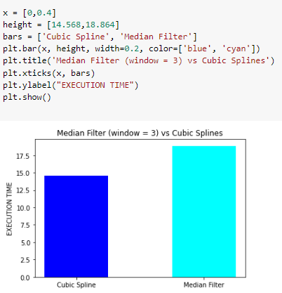

<<<<<<< HEAD
# Audio Restoration through Median Filter and Cubic Spline Interpolation Methods 
After a successful audio restoration through Auto - regression method, we are here to explore other interploation methods which can be used for Audio Restoration (Click - Removal) namely Median Filter and Cubic Splines. Lets enjoy our way through the code.


Before we start, lets hear the degraded and restored output to convince you it really works. THe links are below:

1. Clean original Audio : [clean.webm](https://user-images.githubusercontent.com/114697469/204659412-ef3243ce-9c6c-4f7b-8e22-4e99e1c7dd6c.webm)
2. Degraded Audio with Clicks : [degraded.webm](https://user-images.githubusercontent.com/114697469/204659414-4bd289ad-4c1a-4db6-b0a1-66a520d5f245.webm)
3. Restored Audio (Median Filter) : [restoredmf.webm](https://user-images.githubusercontent.com/114697469/204659409-e0b9c806-8a63-49d2-a907-e142fbfb8cf0.webm)
4. Restored Audio (Cubic Splines) : [restoredcs.webm](https://user-images.githubusercontent.com/114697469/204659407-453d561c-360d-465d-a545-d12d968b4a7b.webm)

## Table of Contents
1. [High-level Description of the project](#my-first-title)
2. [Installation and Execution](#my-second-title)
3. [Methodology and Results](#my-third-title)
4. [Credits](#my-fourth-title) 


## High-level Description of the project
This Assignment follows up on the previous assignment - I, where audio restoration was successfully performed using the Auto-regression method in MATLAB. 
For Assigment - I, Refer https://github.com/ADG4050/Audio-Restoration-MATLAB


I) MEDIAN FILTER INTERPOLATION

The Median Filter Interpolation assignment is started by importing the detection file (A .mat file which contains an array of 0's and 1's, with 1's denoting all the click locations) from MATLAB and reading it for application of the median filter interpolation method. The other input parameter is the window length (A window of digital data upon which the median functionality will be performed). The window length size cannot be even, always has to be odd and an error will be displayed if an even window size is selected.

The output of the function returns the restored audio data without clicks. Inside the main function, we also call the designed median filter function to remove the clicks. The median filter function works in the following order
1) It selects a window of data around the clicks   
    ```
    Data = [1,2000,3,4,5,6,7,8,9]
    suppose window = 3, click data = 2000
    Window = [1,2000,3]  

2) It adds a zero pad wrapping over the window so that all values are considered for the median selection.

    ```
    [0,1,2000,3,0]
    First Window = [0,1,2000]    
    Second Window = [1,2000,3]    
    Third Window = [2000,3,0]
3) It sorts the data inside the window.

    ```   
    Sorted windows = [0,1,2000], [1,3,2000], [0,3,2000]
4) It replaces the click with the median value of the window.

    ```    
    Final window = [1,3,3]
5) It replaces the window in the data signal with the new window, which removes the clicks

    ```
    Restored Data = [1,3,3,4,5,6,7,8,9]
This function is iterated over all the clicks and the clean restored signal is obtained. A graph containing the clean, degraded, and the restored signal is plotted for comparision. 

Finally, the mean squared error and execution time is compared for different window length.

Moreover, two unit tests are performed to check the restored data value's correctness, comparing it with the inbuilt median filter function from the Python library Scipy.

II) CUBIC SPLINES INTERPOLATION

The cubic spline interpolation is performed using the inbuilt cubic spline interpolates inbuilt function available in Python Library Scipy.interpolate

The location of the clicks of the degraded audio is already available through the detection file from MATLAB. The restored signal is obtained in the following steps

1) A new array, containing the signal data without the clicks is created, which is named the Y_ind array.
    ```
    Signal = [101,10,2000,30,40,50,60,72], 
    click = 2000
    Y_ind = [101,10,30,40,50,60,72]
2) Another array, containing the indices of the signal data without the clicks is created, which is named the X_ind array.
    ```
    X_ind = [0,1,3,4,5,6,7]
3) A cubic spline function is created through X_ind and Y_ind.
    ```
    f(x,y) = spline(X_ind, Y_ind)
4) The cubic spline function is applied in the location of clicks and the clicks are overwritten with the new values from the function.
    ```
    data(click) = spline(click)
A graph is plotted for the restored signal and compared with the clean signal. The mean square error is computed further to confirm the claim.

## Installation and Execution

1)The pipreqs *https://github.com/ADG4050/Audio-Restoration/blob/main/requirements.txt* file available in Github provides all the versions and libraries of the import files used in the project.The imports can be installed on a different machine using `pip install import name`.

For more details check [here](https://github.com/bndr/pipreqs)

    i) matplotlib==3.6.2
    ii) numpy==1.23.4
    iii) playsound==1.2.2
    iv) scipy==1.9.3
    v) tqdm==4.64.1


2)After installing all the import packages, the main file and cubic spline file can be run using the following command in the CMD terminal

    i) python main.py

    ii) python cubspl_filter.py


3)The wavwrite file function is commented as the restored files are already inside Github. Both the commands can be uncommented for their respective functions to run. 

4)For different window length outputs, the window length has to be changed manually and outputs needs to be observed.


## Methodology and Results

**Unit tests**

Two Unittests are checked in the median filter program to confirm their functionality.
1) Check Length: The length of the signal data array of the clean, degraded, and restored arrays are checked. The test is passed, if all the lengths are the same.
2) Inbuilt Function = designed Function: The designed function returned values are compared with the values obtained from the Inbuilt Function from Scipy. If both values are the same, the test is passed.

Finally, the MSE for the Cubic Spline and Median Filter provides the accuracy of the filters. However, for the median filter, it is observed that changing window lengths leads to different MSEs.


**Results**

1. For the median filter, different lengths were explored to test the effectiveness of the restoration. 
A Table is made to note the different MSE's for different window length.


Moreover a graph is plotted to visualise the MSE vs Window length


In particular, the clean, degraded and restored signals were plotted and compared.


2. The output waveform using the cubic splines is also shown below, 


3. Comparing the two different interpolation methods, we notice that cubic slpines achieves a lower MSE than Median filter. The runtime of Cubic slpines is also less compared to Median Filter with window = 3, which has the minimum mse. The below graphs demonstates the findings





After listening to the two restored files, we notice that all the clicks have been removed. 
Hence we conclude that both the methods work for audio restoration, with Cubic spline edging a better accuracy and runtime. 


---
## Credits

This code was developed for purely academic purposes by (ADG4050) as part of the module of Computational Methods (5c22) in Trinity College Dublin

The following resources were analysed for the same:
- Lecture Modules by Dr Angeliki Katsenou [https://angkats.github.io/] 
- Scipy Library [https://scipy.org/]
=======
# Audio-Restoration-MATLAB
Audio Restoration using Auto Regression Method
This code was developed for purely academic purposes by (ADG4050) as part of the module of Computational Methods (5c22) in Trinity College Dublin

Refer the Report provided, which describes the algorithm and the MATLAB code designed for detection and removal of clicks in degraded audio tracks. The sample clean audio undertaken for this project is a ten
seconds clip, which is then degraded artificially and restored again. The restored clip is then compared to the original clean clip and different performance analysis charts, graphs and tables
are plotted. 

Report : https://github.com/ADG4050/Audio-Restoration-MATLAB/blob/main/A%20Duttagupta_AR_Report.pdf

Installation
1) MATLAB : Version R2021b
2) Download the wav files and keep them in the same directory as the MATLAB files.
3) Download the .m function files and keep them in the same directory as the main MATLAB file.
4) Run the MATALB demo.m file through Editor and check graphs
5) Observe the values thoeugh the command section
6) To play the audios, execute the command in the command section "sound (restored, Fs)" for restored.wav

Clean Original Audio : [clean.webm](https://user-images.githubusercontent.com/114697469/204786663-77cae933-598b-4386-b442-cd5a9910b0e4.webm)

Degraded Audio: [degraded.webm](https://user-images.githubusercontent.com/114697469/204786665-90e0d035-3c02-4bfc-933a-dd88171bad9a.webm)

Restored Audio: [restored.webm](https://user-images.githubusercontent.com/114697469/204786659-71b30578-0f85-420f-83ea-8bbae8aa2465.webm)

**LISCENSE**


The Following Code has been licensed from MIT license

>>>>>>> a29f0533c1a567a9cb4164e8900041d6adc92333
